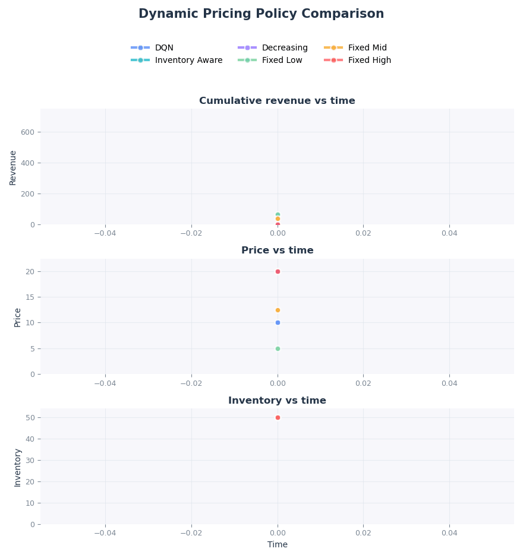
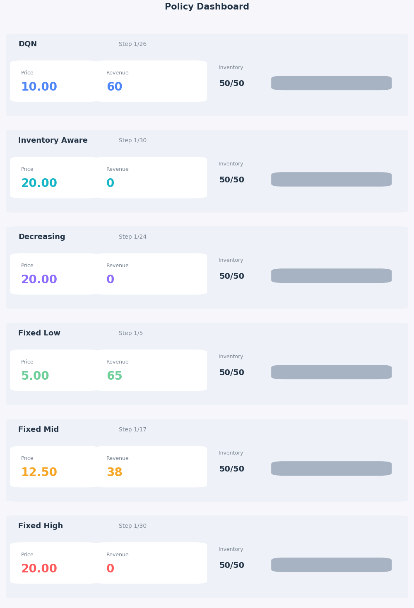

# 💰RL for Dynamic Pricing

A reinforcement learning project for dynamic pricing under uncertain demand in a simulated e-commerce setting.

The agent learns how to set prices over time to maximize revenue while managing limited inventory and stochastic customer behavior.

---

## 🎯 Problem

A seller has:
- limited inventory
- a fixed selling horizon

At each time step:
- customers arrive (stochastic traffic)
- the agent sets a price
- customers buy with probability depending on price
- inventory decreases based on sales

The goal is to maximize total revenue before:
- inventory is depleted, or
- the time horizon ends

---

## Environment

The simulator is simple but realistic.

### Key components

**Time-varying traffic**  
Customer arrivals follow a Poisson process.

**Price-dependent conversion**  
Purchase probability decreases with price (sigmoid).

**Stochastic sales**  
Sales ~ Binomial(arrivals, conversion probability).

**Finite inventory**  
Sales are capped by remaining stock.

---

## RL formulation

- **State**  
  inventory remaining (normalized), time remaining (normalized)

- **Action**  
  choose a price from a discrete grid (31 levels)

- **Reward**  
  revenue = price × units sold

---

## 🤖 Model

We use Deep Q-Network (DQN):

- feedforward neural network
- replay buffer
- target network
- epsilon-greedy exploration

---

## Baselines

- Fixed Low Price  
- Fixed Medium Price  
- Fixed High Price  
- Decreasing Price (heuristic)  
- Inventory-Aware heuristic  

---

## Results

Evaluation over 50 episodes:

| Policy              | Mean Revenue | Std |
|--------------------|-------------|-----|
| **DQN**            | **677.6**   | 11.2 |
| Fixed Mid          | 625.0       | 0.0 |
| Decreasing Price   | 563.2       | 51.5 |
| Fixed Low          | 250.0       | 0.0 |
| Fixed High         | 208.4       | 66.6 |

**Key takeaway**  
The RL agent learns a better trade-off between price and conversion than all baselines.

---

## Visualizations

### Policy comparison



### Dashboard



---

## 🛠 Project structure

```rl-dynamic-pricing/
├── pricing_rl/
│   ├── env.py
│   ├── agent.py
│   ├── replay_buffer.py
│   ├── baselines.py
│   ├── plotting.py
│   └── utils.py
├── train.py
├── evaluate.py
├── plot_results.py
├── outputs/
└── tests/
```
---

## 🚀 How to run

Train:
python train.py

Evaluate:
python evaluate.py

Plots:
python plot_results.py

---

## © Author

Melidi Georgii, 2026

This project is released under the MIT License.
